I work close to the hardware — networking, embedded targets, and software that
treats privacy as a constraint rather than a feature. I usually start from a
problem I actually have and stop once it runs.

[](https://vixxer.dev)
[](mailto:c.servingonzalez@ugto.mx)

---

## ~/building

**[Vixxer](https://vixxer.dev)** — software studio  
Designs and ships its own products with privacy and security as the baseline,
not an afterthought. First product in development: **Vixxer Mensajero**, a
messaging app built so the conversations stay actually private.  
[vixxer.dev](https://vixxer.dev) · [github.com/V-i-x-x-e-r](https://github.com/V-i-x-x-e-r)

**Tao** — embedded AI agent  
A conversational agent running on an STM32, wired to a private inference server
so responses stay fast on hardware that has no business running an assistant.
An experiment in pushing AI past the usual cloud-client setup.

## ~/stack

```txt
languages    c · c++ · python · sql
systems      arch linux · git · cisco
focus        networking · cybersecurity · low-level
```
